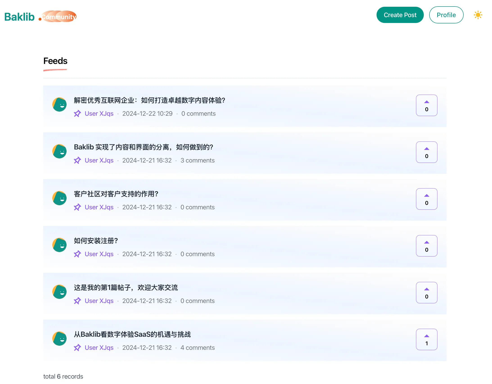
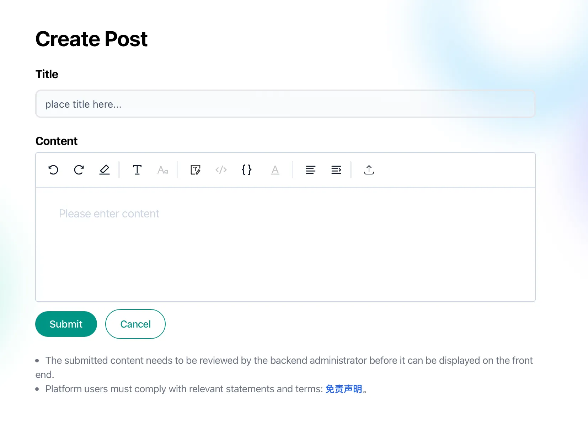

# Baklib Community（问答社区）模板

[English readme（主文档）](./README.md)

现代化的问答社区模板，对标 **Discourse**（论坛布局、时间线、侧栏）、**Reddit**（线性列表与帖子流）及 **Stack Overflow** 类结构化问答场景。提供完整的帖子发布、多层级回复、标签分类、集合管理、时间线展示等功能，适用于知识库、FAQ、技术支持、社区讨论等场景。

**教程**： https://help.baklib.cn/themes/community/question  

**Demo**： https://demo-question.uibak.com/

**模板标识**：`theme_name` 为 `community`（见 `config/settings_schema.json`）。若从旧 id 升级，请在 Baklib 环境中确认站点绑定与迁移方式。

---

## 核心特性

### 双模板风格

- **Reddit 风格** (`page.liquid`)：传统垂直布局，适合简洁的问答展示
- **Discourse 风格** (`page.two.liquid`)：现代三栏布局，包含左侧导航、主内容区和右侧时间线

### 主要功能

- **帖子发布与管理**：用户可以发布问题，提供标题、正文、标签和集合分类
- **多层级回复系统**：支持无限层级的嵌套回复，两种风格可选
  - Reddit 风格：作者/日期在上方，内容在下方
  - Discourse 风格：头像在左侧，作者+时间同一行，时间右对齐
- **标签与集合**：支持多标签分类和集合管理，在列表页和详情页展示
- **时间线展示**：Discourse 风格中提供右侧时间线，显示主帖和回复的时间节点
- **相关主题推荐**：自动推荐相关话题，提升内容发现
- **点赞/反馈系统**：支持对帖子进行点赞反馈
- **搜索功能**：站内搜索入口（页头「更多」菜单）
- **用户个人资料**：显示用户活动等（依赖平台账号体系）
- **审核机制**：支持先发后审或先审后发两种模式
- **响应式设计**：适配桌面端和移动端

---

## 截图






---

## 项目结构（节选）

```text
├── README.md                 # 英文主文档
├── README.zh-CN.md           # 本文件
├── config/settings_schema.json
├── locales/
│   ├── zh-CN.json / zh-CN.schema.json
│   ├── en.json / en.schema.json
│   ├── de.json / de.schema.json（德语）
│   ├── fr.json / fr.schema.json（法语）
│   └── ja.json / ja.schema.json（日语）
├── statics/about.liquid      # /s/about 说明页
├── statics/tag.liquid / tags.liquid
├── templates/index.liquid / index.forum.liquid / page.liquid / page.two.liquid
└── snippets/ …
```

完整树状结构见 [README.md](./README.md)。

---

## 使用说明

1. 在 Baklib 后台选择此模板（Community）
2. 配置站点设置（LOGO、默认头像、审核模式等）
3. 设置集合标签与功能标签（用于帖子分类）
4. 在页面管理中为首页与帖子选择 Reddit 或 Discourse 对应模板
5. 可通过导航菜单链接至 `/s/about` 查看模板说明与操作教程

前台文案位于 `locales/`（含 zh-CN、en、de、fr、ja）；后台编辑器中的分区与模板字段标签通过 `locales/*.schema.json` 中的 `settings_schema.community*`、`community_templates*` 多语言维护。`seeds/` 初始化数据默认为英文站点语言与英文示例内容。

---

## 技术栈

- TailwindCSS + Stimulus + Turbo  
- Liquid  

---

## 特色功能

- 双风格模板切换  
- 无限层级嵌套回复  
- 标签和集合分类  
- 时间线展示  
- 相关主题推荐  
- 响应式设计  
- 暗色模式支持  
- Turbo Stream 实时更新  
